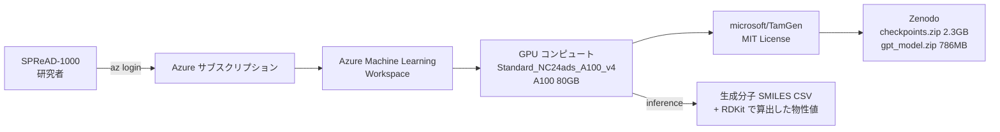

# TamGen クイックスタート — 標的タンパク質を指定した AI 創薬

Azure Machine Learning の GPU コンピュート上で、Microsoft Research が公開している **TamGen**（Target-aware Molecule Generation）を動かし、任意のタンパク質構造（PDB）に結合する新規小分子候補を生成します。

> [!NOTE]
> 本ガイドは **文部科学省 SPReAD-1000 採択者** 向けです。Azure を初めて使う方、AI for Science 未経験の方でも、コピー＆ペーストで最短 90 分以内にゴールに到達できます。

> [!IMPORTANT]
> **本ガイドはハンズオン教材です。** 生成された分子は **未検証の計算予測** であり、結合親和性・安全性・合成可能性のいずれも実験的に確認されていません。合成・実験に進む前に必ず [04-interpret-results.md](docs/04-interpret-results.md#生成結果の位置づけ) と [05-cleanup.md](docs/05-cleanup.md) を確認し、所属機関の生命倫理・二重使用（デュアルユース）審査を通してください。

---

## 何ができるか

- 指定した PDB ID（例：`3wze`）の結合ポケットから、AI が **新規化合物 50 個** を SMILES 形式で生成
- 生成分子に対し、RDKit で分子量・LogP・QED・TPSA・Lipinski 適合を **自分で** 計算（TamGen 出力自体は SMILES のみで、生成順位・重複頻度以外のスコアは付きません）

## こんな研究課題に該当する方向け（生命科学・薬学 分野の例）

SPReAD-1000 採択課題のうち、**小分子リガンド設計** をテーマとする初手として最適です（`docs/source/projects-classified.json` の `primary_category = foundation-model-science / molecular-gnn` に分類された課題）。

- 標的タンパク質（受容体・酵素）に対する新規小分子リガンド設計
- 生成 AI × 有機合成による医薬品リード化合物創出
- 耐性変異を克服する次世代阻害薬設計

> [!WARNING]
> **TamGen は小分子 SMILES ジェネレータです。** ペプチド・ミッドサイズ分子・核酸・タンパク質バインダーの設計には**そのまま適用できません**。それらは別の基盤モデル（BioEmu、ESM3 等）や独自データでの再学習が必要です。

---

## 全体像



## 所要時間・コスト

### 所要時間

| 項目 | 目安 |
|---|---|
| 初回セットアップ | 60〜90 分（うち VM 起動 5 分、conda env 構築 15〜25 分、重み DL 15〜30 分：合計約 3.1 GB） |
| 1 回の推論実行 | 10〜30 分（PDB ダウンロード＋データ前処理＋分子生成） |

### コスト目安（2026-07 時点・参考値・PAYG）

> [!WARNING]
> **料金は変動します。** 実際の請求前に必ず [Azure 料金計算ツール](https://azure.microsoft.com/ja-jp/pricing/calculator/) と [Azure Retail Prices API](https://learn.microsoft.com/ja-jp/rest/api/cost-management/retail-prices/azure-retail-prices) で最新値を確認してください。契約種別・為替により差が出ます。

| SKU | GPU | japaneast Linux 単価 | 用途 |
|---|---|---|---|
| **Standard_NC24ads_A100_v4**（推奨） | A100 80GB × 1 | 約 US$5.33/h（≒ ¥860/h） | 本ガイドの標準構成 |
| Standard_NC8as_T4_v3（低コスト） | T4 16GB × 1 | 約 US$1.02/h（≒ ¥160/h） | 動作確認・小規模生成向け |
| Standard_NC40ads_H100_v5（大規模） | H100 80GB × 1 | 約 US$10.12/h（≒ ¥1,620/h） | 大量サンプリング・複数ポケット並列 |

**Compute Instance を停止しても課金が続く項目**（オフ時も残る）：

- **OS ディスク 120 GB**（Premium SSD, 約 ¥2,500/月）
- **静的パブリック IP**（約 ¥400/月）
- Storage / Key Vault / App Insights / Container Registry Basic（合計 約 ¥500〜1,000/月）

> [!WARNING]
> **計算資源の停止忘れが最大のコスト増加要因** です。作業終了後は必ず [05-cleanup.md](docs/05-cleanup.md) の手順でコンピュートを停止（または削除）してください。

---

## 手順（サマリ）

| Step | ドキュメント | 所要 |
|---:|---|---|
| 1 | [前提条件と権限](docs/01-prerequisites.md) | 5 分 |
| 2 | [Azure ML ワークスペースと GPU コンピュートを作成](docs/02-provision-aml.md) | 15 分 |
| 3 | [TamGen をセットアップして推論を実行](docs/03-run-tamgen.md) | 40〜70 分 |
| 4 | [生成結果を読み解く](docs/04-interpret-results.md) | 10 分 |
| 5 | [後始末（重要）](docs/05-cleanup.md) | 5 分 |

うまくいかないときは [troubleshooting.md](docs/troubleshooting.md) を参照してください。

---

## デプロイ方法の選択肢

3 通りから選べます。**初めての方は方法 A（推奨）** を使ってください。

- **A. Azure CLI スクリプト（推奨・最速）** — [`infra/deploy.sh`](infra/deploy.sh) を実行。「変更するのはここだけ」ブロックで自分の名前などを 1 か所書き換え
- **B. Bicep** — [`infra/main.bicep`](infra/main.bicep) を `az deployment group create` で。CI/CD やチーム展開向け
- **C. Azure Portal（GUI）** — [02-provision-aml.md](docs/02-provision-aml.md) の GUI 手順に沿って画面操作

---

## リソースに付与するタグ

以下の 5 つのタグを **すべてのリソース** に付けます。研究費の課金追跡と、複数シナリオを並走させたときの識別に必須です。

```
project  = spread1000
field    = life-pharma-science
category = foundation-model-science
scenario = tamgen-drug-discovery
owner    = <あなたのメール／エイリアス>
```

> [!NOTE]
> `az ml workspace create`（方法 A）はワークスペース本体しかタグ付けしません。デプロイ完了後、`deploy.sh` が **依存リソース（Storage / Key Vault / App Insights / Container Registry）にも同じタグを追加** します。方法 B（Bicep）は最初から全リソースに付与されます。

## セキュリティ posture（既定値）

**本クイックスタートの既定は「学習用のパブリックネットワーク構成」** です。次のリソースはパブリックエンドポイント経由でアクセス可能（ただし Microsoft Entra ID 認証は必須）：

- Azure ML Workspace / Compute Instance（Jupyter, VS Code）
- Storage Account, Key Vault, App Insights, Container Registry

**未公開研究データ・患者データ・機密情報を扱う場合はこの構成を使わないでください。** その場合は Azure ML の [Managed Virtual Network](https://learn.microsoft.com/ja-jp/azure/machine-learning/how-to-managed-network) / Private Endpoint 構成が必要です（本クイックスタートの対象外）。

## 責任ある AI 利用

> [!WARNING]
> **TamGen 生成分子には毒性・規制物質フィルタは組み込まれていません。** 生成結果は化学構造として妥当なだけで、化学兵器禁止条約 (CWC) 対象化合物・麻薬・毒物を含む可能性があります。合成前に必ず以下を実施してください。

- 所属機関の生命倫理・安全審査・**デュアルユース（軍民両用）審査** プロセスに沿う
- 化学兵器禁止条約 (CWC) 附属書・麻薬及び向精神薬取締法・毒物及び劇物取締法・輸出貿易管理令等、関連する国内法・条約に抵触しないことを法務部門と確認
- ADMET 予測（例：ADMET-AI）と毒性データベース（例：ToxCast）でスクリーニング
- 合成・実験は、免許を有する研究室で実施

## 参考文献・ライセンス

- **論文**: Wu et al., *TamGen: drug design with target-aware molecule generation through a chemical language model*, **Nature Communications** 15:9360 (2024). DOI: [10.1038/s41467-024-53632-4](https://doi.org/10.1038/s41467-024-53632-4)
- **モデル本体**: [microsoft/TamGen (GitHub)](https://github.com/microsoft/TamGen) — MIT License
- **重み・データ**: [Zenodo DOI 10.5281/zenodo.13751391](https://doi.org/10.5281/zenodo.13751391) — CC BY 4.0
- **Foundry Labs ページ**: <https://labs.ai.azure.com/innovations/tamgen/>
- **Discovery エージェント版**（発展）: [microsoft/discovery/agents/tamgen](https://github.com/microsoft/discovery/tree/main/agents/tamgen)

論文引用（BibTeX 例）は [docs/04-interpret-results.md](docs/04-interpret-results.md#引用) を参照。

